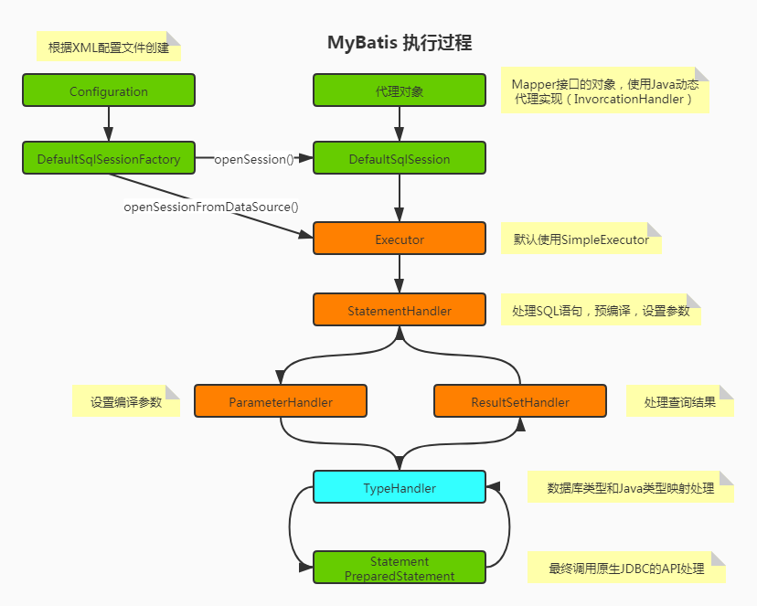
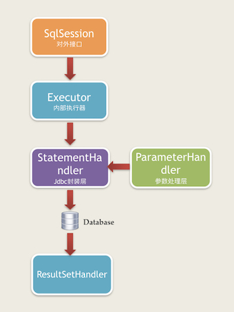

# mybatis拦截器
MyBatis拦截器可以做的工作：SQL修改，分页操作，数据过滤，SQL执行时间性能监控等。

## 基础介绍
### 核心对象
从MyBatis代码实现的角度来看，MyBatis的主要的核心部件有以下几个：
+ Configuration：初始化基础配置，比如MyBatis的别名等，一些重要的类型对象，如插件，映射器，ObjectFactory和typeHandler对象，MyBatis所有的配置信息都维持在Configuration对象之中。
+ SqlSessionFactory：SqlSession工厂。
+ SqlSession：作为MyBatis工作的主要顶层API，表示和数据库交互的会话，完成必要的数据库增删改查功能。
+ Executor：MyBatis的内部执行器，它负责调用StatementHandler操作数据库，并把结果集通过ResultSetHandler进行自动映射，另外，它还处理二级缓存的操作。
+ StatementHandler：MyBatis直接在数据库执行SQL脚本的对象。另外它也实现了MyBatis的一级缓存。
+ ParameterHandler：负责将用户传递的参数转换成JDBC Statement所需要的参数。是MyBatis实现SQL入参设置的对象。
+ ResultSetHandler：负责将JDBC返回的ResultSet结果集对象转换成List类型的集合。是MyBatis把ResultSet集合映射成POJO的接口对象。
+ TypeHandler：负责Java数据类型和JDBC数据类型之间的映射和转换。
+ MappedStatement：MappedStatement维护了一条<select|update|delete|insert>节点的封装。
+ SqlSource ：负责根据用户传递的parameterObject，动态地生成SQL语句，将信息封装到BoundSql对象中，并返回。
+ BoundSql：表示动态生成的SQL语句以及相应的参数信息。

### 执行过程

## 实现步骤
+ 写一个实现org.apache.ibatis.plugin.Interceptor接口的拦截器类，并实现其中的方法。
+ 添加@Intercepts注解，写上需要拦截的对象和方法，以及方法参数。
+ Spring项目注意添加@Component注解即可，使其成为Spring管理的一个Bean。
### 添加注解
MyBatis拦截器默认可以拦截的类型只有四种，即四种接口类型Executor、StatementHandler、ParameterHandler和ResultSetHandler。对于我们的自定义拦截器必须使用MyBatis提供的@Intercepts注解来指明我们要拦截的是四种类型中的哪一种接口。

| 注解             | 描述                   |
|:-----------------|:-----------------------|
| @Intercepts         | 标志该类是一个拦截器         |
| @Signature	 | 指明该拦截器需要拦截哪一个接口的哪一个方法|
@Signature注解的参数：

| 参数             | 描述                                    |
|:-----------------|:--------------------------------------|
| type         | 四种类型接口中的某一个接口，如Executor.class。        |
| method         | 对应接口中的某一个方法名，比如Executor的query方法。      |
| args	 | 对应接口中的某一个方法的参数，比如Executor中query方法因为重载原因，有多个，args就是指明参数类型，从而确定是具体哪一个方法。                 |

#### type
MyBatis拦截器默认会按顺序拦截以下的四个接口中的所有方法：

org.apache.ibatis.executor.Executor  //拦截执行器方法
org.apache.ibatis.executor.statement.StatementHandler  //拦截SQL语法构建处理
org.apache.ibatis.executor.parameter.ParameterHandler  //拦截参数处理
org.apache.ibatis.executor.resultset.ResultSetHandler  //拦截结果集处理

具体是拦截这四个接口对应的实现类：
org.apache.ibatis.executor.CachingExecutor
org.apache.ibatis.executor.statement.RoutingStatementHandler
org.apache.ibatis.scripting.defaults.DefaultParameterHandler
org.apache.ibatis.executor.resultset.DefaultResultSetHandler



#### method
这个可以根据MyBatis源码了解下。

#### args
根据参数类型区分重载的方法。


### 方法实现
#### intercept
进行拦截的时候要执行的方法。该方法参数Invocation类中有三个字段：
```java
    private final Object target;
    private final Method method;
    private final Object[] args;
```
可通过这三个字段分别获取下面的信息：
```java
    Object target = invocation.getTarget();//被代理对象
    Method method = invocation.getMethod();//代理方法
    Object[] args = invocation.getArgs();//方法参数
```
| 拦截接口             | 接口实现类                   |
|:-----------------|:------------------------|
| Executor         | CachingExecutor         |
| StatementHandler | RoutingStatementHandler |
| ParameterHandler | DefaultParameterHandler |
| ResultSetHandler | DefaultResultSetHandler |

```java
@Intercepts({
    @Signature(type = Executor.class, method = "query", args = {MappedStatement.class, Object.class, RowBounds.class, ResultHandler.class}),
    @Signature(type = StatementHandler.class, method = "prepare", args = {Connection.class, Integer.class}),
    @Signature(type = ParameterHandler.class, method = "setParameters", args = {PreparedStatement.class}),
    @Signature(type = ResultSetHandler.class, method = "handleResultSets", args = {Statement.class})
})
```

#### plugin
插件用于封装目标对象的，通过该方法我们可以返回目标对象本身，也可以返回一个它的代理，可以决定是否要进行拦截进而决定要返回一个什么样的目标对象，官方提供了示例：return Plugin.wrap(target, this);，可以在这个方法中提前进行拦截对象类型判断，提高性能：
```java
    @Override
    public Object plugin(Object target) {
        //只对要拦截的对象生成代理
        if(target instanceof StatementHandler){
            //调用插件
            return Plugin.wrap(target, this);
        }
        return target;
    }
```
MyBatis拦截器用到责任链模式+动态代理+反射机制；
所有可能被拦截的处理类都会生成一个代理类，如果有N个拦截器，就会有N个代理，层层生成动态代理是比较耗性能的。而且虽然能指定插件拦截的位置，但这个是在执行方法时利用反射动态判断的，初始化的时候就是简单的把拦截器插入到了所有可以拦截的地方。所以尽量不要编写不必要的拦截器。另外我们可以在调用插件的地方添加判断，只要是当前拦截器拦截的对象才进行调用，否则直接返回目标对象本身，这样可以减少反射判断的次数，提高性能。

#### setProperties
如果我们拦截器需要用到一些变量参数，而且这个参数是支持可配置的，类似Spring中的@Value("${}")从application.properties文件获取自定义变量属性，这个时候我们就可以使用这个方法。

（1）在application.properties文件中添加配置：
```properties
mybatis.config-location=classpath:mybatis-config.xml
```
（2）在resources目录下添加mybatis-config.xml配置文件，并添加插件和属性配置。添加完需要注意去掉自定义MyBatis拦截器上的@Component注解，否则该拦截器相当于注册了两个，会执行两遍拦截方法。

```xml
<?xml version="1.0" encoding="UTF-8" ?>
<!DOCTYPE configuration
  PUBLIC "-//mybatis.org//DTD Config 3.0//EN"
         "http://mybatis.org/dtd/mybatis-3-config.dtd">
<configuration>
    <plugins>
        <plugin interceptor="com.example.demo.mapper.plugin.MyPlugin">
            <property name="key1" value="value1"/>
            <property name="key2" value="value2"/>
            <property name="key3" value="value3"/>
        </plugin>
    </plugins>
</configuration>
```
（3）在拦截器插件的setProperties方法中进行。这些自定义属性参数会在项目启动的时候被加载。

```java
    @Override
    public void setProperties(Properties properties) {
        System.out.println("key1=" + properties.getProperty("key1"));
        System.out.println("key2=" + properties.getProperty("key2"));
        System.out.println("key3=" + properties.getProperty("key3"));
    }
```
## 代码实例
```java
package com.example.demo.mapper.plugin;

import org.apache.ibatis.executor.statement.StatementHandler;
import org.apache.ibatis.plugin.*;
import java.lang.reflect.Method;
import java.sql.Connection;
import java.util.Properties;

@Intercepts({
    @Signature(type = StatementHandler.class, method = "prepare", args = {Connection.class, Integer.class})
})
public class MyPlugin implements Interceptor {

    Properties properties = null;

    /**
     * 拦截方法逻辑
     * 这里主要是通过反射去获取要执行的SQL相关信息，然后进行操作
     */
    @Override
    public Object intercept(Invocation invocation) throws Throwable {
        Object target = invocation.getTarget();//被代理对象
        Method method = invocation.getMethod();//代理方法
        Object[] args = invocation.getArgs();//方法参数
        // do something ...... 方法拦截前执行代码块
        Object result = invocation.proceed();
        // do something .......方法拦截后执行代码块
        return result;
    }

    /**
     * 生成MyBatis拦截器代理对象
     */
    @Override
    public Object plugin(Object target) {
        if(target instanceof StatementHandler){
            //调用插件
            return Plugin.wrap(target, this);
        }
        return target;
    }

    /**
     * 设置插件属性（直接通过Spring的方式获取属性，所以这个方法一般也用不到）
     * 项目启动的时候数据就会被加载
     */
    @Override
    public void setProperties(Properties properties) {
        //赋值成员变量，在其他方法使用。
        this.properties = properties;
    }
}
```

