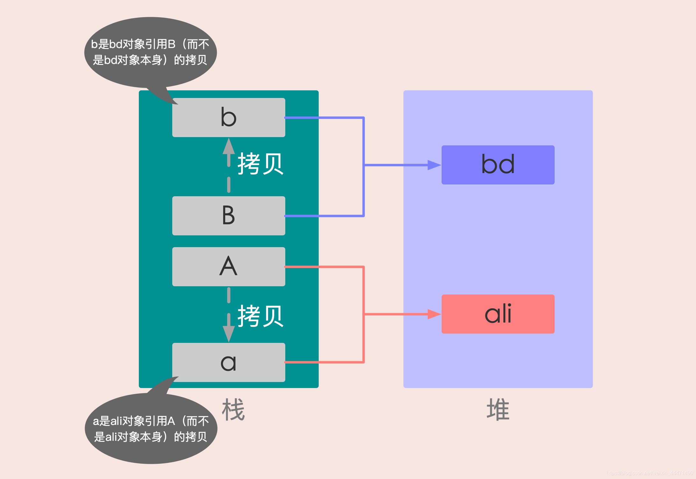
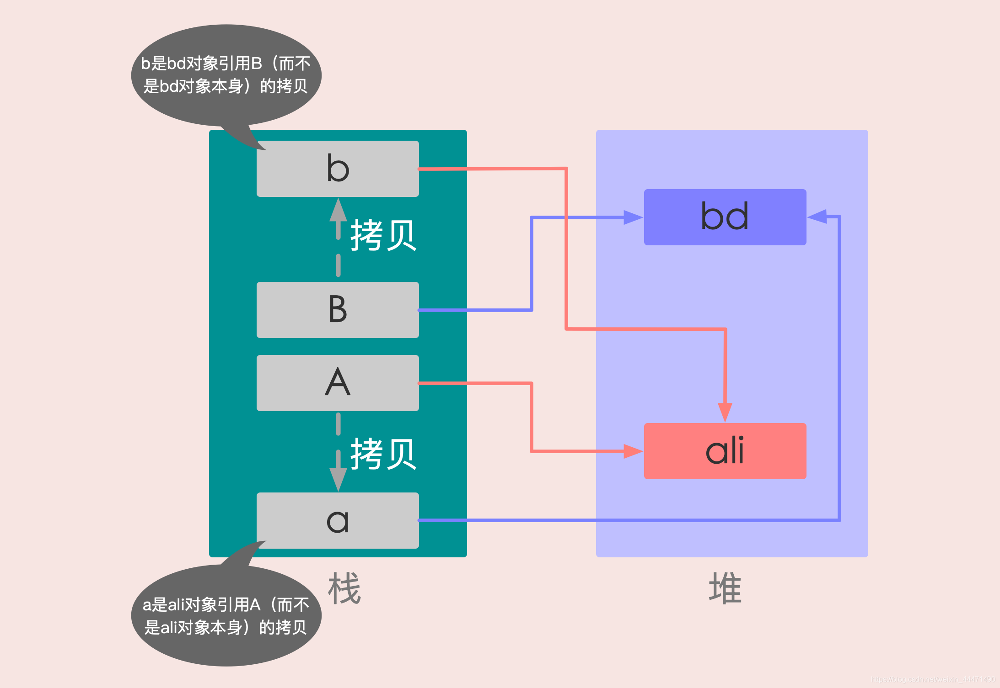

# java_learn

## Java是值传递还是引用传递

值传递和引用传递的区别

值传递：就是在方法调用的时候，实参是将自己的一份拷贝赋给形参，在方法内，对该参数值的修改不影响原来的实参。

引用传递：是在方法调用的时候，实参将自己的地址传递给形参，此时方法内对该参数值的改变，就是对该实参的实际操作。

### 首先确定一点：Java中只有值传递

Java 程序设计语言总是采用按值调用。也就是说，方法得到的是所有参数值的一个拷贝，即，方法不能修改传递给它的任何参数变量的内容。

#### case1:基本数据类型交换

在 swap() 方法中，a、b 的值进行交换，并不会影响到 A、B。因为，a、b 中的值，只是从 A、B 复制过来的。也就是说，a、b 相当于 A、B
的副本，副本的内容无论怎么修改，都不会影响到原件本身。

```java
public class Case1 {

    public static void main(String[] args) {
        int A = 2;
        int B = 3;
        swap(A, B);
        System.out.println(A);
        System.out.println(B);
    }

    public static void swap(int a, int b) {
        int tmp = a;
        a = b;
        b = tmp;
    }
}
```

运行结果：

```java
2
3
```

发现A和B的值并没有交换

因为Java中采用的是值传递，也就是说执行swap(int a, int b)时，这里的参数a和b，只是A和B的副本，方法的运行结果并没有改变原来A和B的值。

#### case2:包装类交换

```java
public class Case2 {
    public static void main(String[] args) {
        Integer A = 2;
        Integer B = 3;
        swap(A, B);
        System.out.println(A);
        System.out.println(B);
    }

    public static void swap(Integer a, Integer b) {
        Integer tmp = a;
        a = b;
        b = tmp;
    }
}
```

运行结果：

```java
2
3
```

发现A和B的值并没有交换

去查看Integer的源码：

```java
public final class Integer extends Number implements Comparable<Integer> {
    private final int value;
}
```

可以看到Integer使用final修饰的int进行存储。final修饰的变量不能被重新赋值，所以操作参数传递变量时，实际上是操作变量对象的副本（Java中的包装类型都是默认使用这种方式实现的，使用拷贝副本的方式提升效率和减少内存消耗）。

和上面情况类似 因为Java中采用的是值传递，也就是说执行swap(Integer a, Integer b)
时，这里的参数a和b，只是A和B的引用的副本，方法的运行结果并没有改变原来A和B的值。

#### case3:改变数组内的值

```java
public class Case3 {
    public static void main(String[] args) {
        int[] arr = {1, 2, 3, 4, 5};
        System.out.println(arr[0]);
        change(arr);
        System.out.println(arr[0]);
    }

    public static void change(int[] array) {
        // 将数组的第一个元素变为0
        array[0] = 0;
    }
}
```

运行结果：

```java
1
0
```

这里方法的参数array是对象的引用arr的拷贝，而不是对象本身的拷贝，因此， array 和 arr 指向的是同一个数组对象。

#### case4:改变对象的引用

有些程序员认为 Java 程序设计语言对对象采用的是引用调用，实际上，这种理解是不对的。由于这种误解具有一定的普遍性，所以下面给出一个反例来详细地阐述一下这个问题。

```java
public class Case4 {
    public static void main(String[] args) {
        User1 A = new User1("ali");
        User1 B = new User1("bd");
        System.out.println("交换前name：" + A + "-->" + B);
        swap(A, B);
        System.out.println("交换后name：" + A + "-->" + B);
    }

    private static void swap(User1 a, User1 b) {
        User1 tmp = a;
        a = b;
        b = tmp;
    }
}

class User1 {
    private String name;

    public User1(String name) {
        this.name = name;
    }

    public String getName() {
        return name;
    }

    public void setName(String name) {
        this.name = name;
    }

    @Override
    public String toString() {
        return name;
    }
}
```

运行结果：

```java
交换前name：ali-->bd
交换后name：ali-->bd
```

发现还是没有交换！

所以到底有没有交换，主要是看它修改的是变量（引用）还是修改的堆里面的对象。

交换前：

交换后：


通过上面两张图可以很清晰的看出： 方法并没有改变存储在变量 A 和 B 中的对象引用。swap() 方法的参数 a 和 b
被初始化为两个对象引用的拷贝，这个方法交换的是这两个拷贝。

#### case5:改变对象的引用PLUS版本

```java
public class Case5 {
    public static void main(String[] args) {
        User2 user = new User2(); //new Class 引用类型，调用 pass 方法后 name 与 age 的值改变了
        user.setName("main"); // 调用 pass 后，name 为 pass 了
        user.setAge(2); //调用 pass 后，age 为 4 了
        pass(user); //pass 方法调用
        System.out.println("main 方法 user 是：" + user);
    }

    public static void pass(User2 user) {
        user = new User2();
        user.setName("pass");
        user.setAge(4);
        System.out.println("pass 方法 user 是：" + user);
    }
}

class User2 {
    String name;
    int age;

    public String getName() {
        return name;
    }

    public void setName(String name) {
        this.name = name;
    }

    public int getAge() {
        return age;
    }

    public void setAge(int age) {
        this.age = age;
    }

    @Override
    public String toString() {
        return "name = " + name + " --- age = " + age;
    }
}
```

```java
pass 方法 user 是：name=pass---age=4
main 方法 user 是：name=main---age=2
```

该例子可以更好的解释传递到方法pass中的的参数实质上是该参数内存地址的拷贝 在pass方法中改变了引用并没有影响main方法中的结果